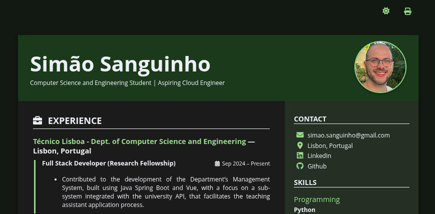

# Simão Sanguinho - CV Website

This repository contains the source code for my personal CV website, built using [Hugo](https://gohugo.io/). The site is designed to showcase my professional experience, education and skills.

Visit the live site at: [cv.ssanguinho.pt](https://cv.ssanguinho.pt/)



## Repository Layout

- **`data/content.yaml`** → contains the actual CV data  
- **`layouts/`** → includes the HTML templates used to render the pages  

---

## Getting Started

To run the project locally, you’ll need [Hugo](https://gohugo.io/). Once installed, run:

```bash
hugo server -D

```

## Building the Site
To build the site for production, use:

```bash
hugo --minify
```

## Deployment
To deploy it through [Cloudflare Pages](https://pages.cloudflare.com/), run the following command:

```bash
hugo --minify && npx wrangler pages deploy public --project-name cv
```

To run this command the wrangler.toml file is used.

However thew current setup allows the Cloudflare Pages to automatically build and deploy the site whenever changes are pushed to the main branch, so you can simply push your changes and let Cloudflare handle the deployment.